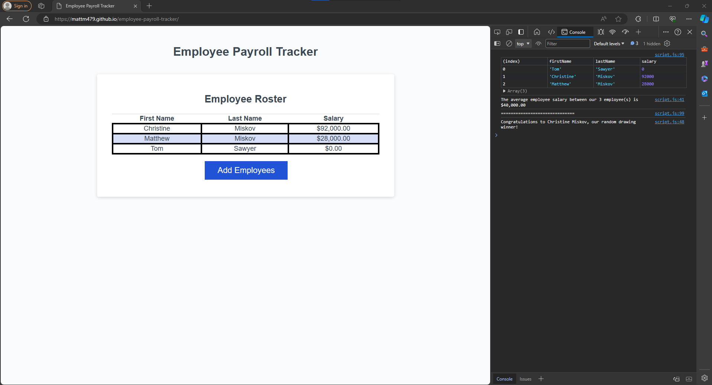

# Employee Payroll Tracker Webpage

## Description

This webpage was written to be able to track employee's payroll. It allows the user to ass an employee's first name, last name and salary. You have the option
to add as many employees at a time as you want. Once all the employees have been added they will be displayed in the table on the webpage and in the console,
you will see the average salary of all the employees plus the winner of the random drawing. I built this project because it gave me valuable experience practicing what 
I have learned in Javascript up until now. I learned how to use prompts to get input from users, learned how to crete objects and add them to an array. I learned how to return data from a function 
as well as have to format numbers. The last thing I learned was how to select a random object from an array.

## Usage

To use the webpage, please navigate to https://mattm479.github.io/employee-payroll-tracker. You will need to open the console to see the average salary and random employee selected. This webpage will look similar to the screenshot below:

## License

License can be found [here](LICENSE).